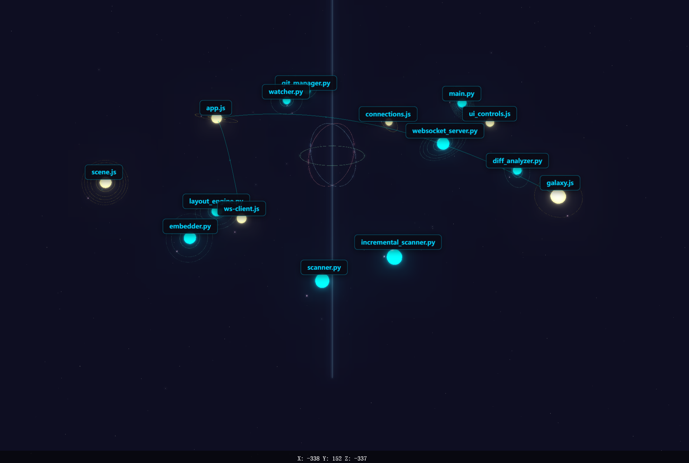
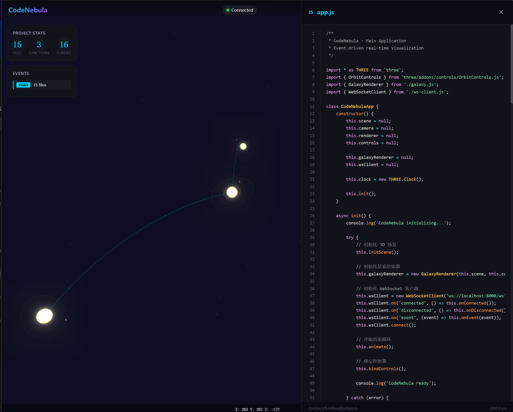
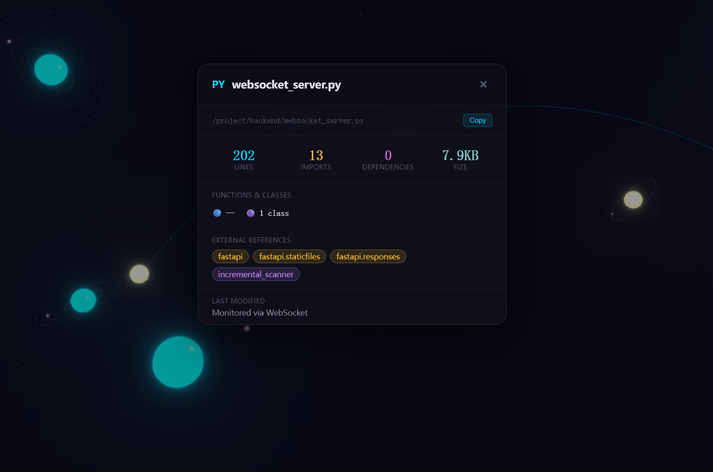

# CodeNebula

> Visualize your codebase as a living galaxy of stars

CodeNebula transforms your code repository into an interactive 3D visualization. Each file becomes a star, classes and functions become orbiting planets, and imports create gravitational connections between them.



Explore your codebase as a living galaxy — files become stars, imports form gravitational connections.

## Features

- **Real-time Monitoring**: Watchdog tracks file changes with millisecond-level response
- **Event-Driven Visualization**: File changes trigger visual effects - modifications pulse, new files explode into existence, deleted files fade away
- **Galaxy Distribution**: Files are distributed in a spiral pattern like a real galaxy
- **Incremental Analysis**: Only changed files are scanned - no wasted CPU cycles
- **Code Preview**: Click on any star to preview its contents
- **Adjustable Settings**: Customize disk radius, height, star sizes, and more
- **Persistent Preferences**: Your settings are saved locally

## Quick Start

### Option 1: Run with Docker

```bash
# Clone the repository
git clone https://github.com/yourusername/codenebula.git
cd codenebula

# Run with Docker Compose (specify your project path)
PROJECT_PATH=/path/to/your/project docker-compose up --build

# Open browser to http://localhost:8000
```

### Option 2: Run Directly

```bash
# Clone the repository
git clone https://github.com/yourusername/codenebula.git
cd codenebula

# Install dependencies
pip install -r requirements.txt

# Run
cd backend
python main.py --path /path/to/your/project

# Open browser to http://localhost:8000
```

## Usage

1. Enter the path to your code project in the input field
2. Click "Scan Project" or press Enter
3. Use your mouse to orbit, zoom, and explore the galaxy
4. Hover over stars to see connections highlight
5. Click on a star to preview its code
6. Right-click for file details

### Code Preview



Click on any star to open the code preview drawer. View syntax-highlighted code with support for Python, JavaScript, and TypeScript. Drag the left edge to resize.

### File Details



Right-click on any star to view file details including line count, external imports, dependencies, functions, classes, and external references categorized by type (framework, builtin, third-party, other).

### Keyboard Shortcuts

- `Space`: Pause/resume animation
- `Escape`: Close code preview or detail panel
- `P`: Toggle path selector

## Project Structure

```
CodeNebula/
├── backend/
│   ├── main.py                 # Entry point
│   ├── watcher.py              # File system watcher
│   ├── diff_analyzer.py        # Git diff analysis
│   ├── incremental_scanner.py   # Incremental AST scanner
│   └── websocket_server.py      # WebSocket server
├── frontend/
│   └── index.html              # Single-page application
├── requirements.txt            # Python dependencies
├── Dockerfile                 # Docker configuration
├── docker-compose.yml         # Docker Compose setup
└── LICENSE                    # MIT License
```

## Event Types

| Event | Visual Effect | Description |
|-------|--------------|-------------|
| MODIFIED | Pulse | Star flickers with expanding glow |
| CREATED | Explosion | Supernova burst animation |
| DELETED | Fade | Star fades out and disappears |

## Supported Languages

- Python (.py)
- JavaScript (.js)
- TypeScript (.ts)
- JSX (.jsx)
- TSX (.tsx)

## Technical Stack

- **Backend**: Python 3.11+ / FastAPI / Uvicorn / Watchdog
- **Frontend**: Three.js / WebGL / Vanilla JavaScript
- **Communication**: WebSocket real-time updates

## Architecture

```
File Change → Watchdog → Incremental Scan → WebSocket Broadcast
                                           ↓
                          Frontend Receives → Triggers Animation
```

## Configuration

Settings can be adjusted in the side panel:

- **Disk Radius**: How spread out the galaxy is
- **Disk Height**: How thick the galaxy disk is
- **Edge Thinness**: Concentration of stars at edges
- **Star Size**: Base size multiplier for stars
- **Planet Size**: Base size multiplier for planets

Display options:
- Central Axis & Grid
- Orbit Rings
- Connections
- Focus Mode (highlights related connections on hover)

## Contributing

Contributions are welcome! Please feel free to submit a Pull Request.

## License

This project is licensed under the MIT License - see the [LICENSE](LICENSE) file for details.

---

Made with ⭐ for developers who love to visualize their code
